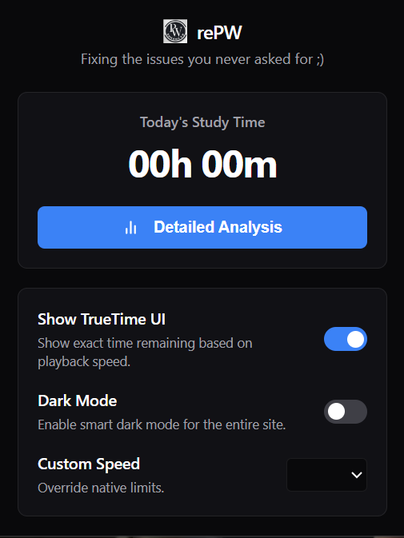
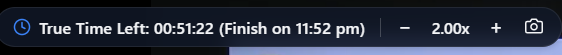
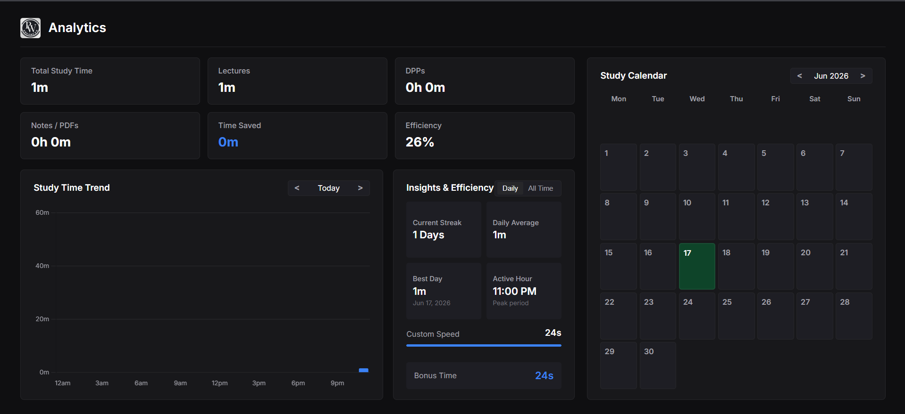
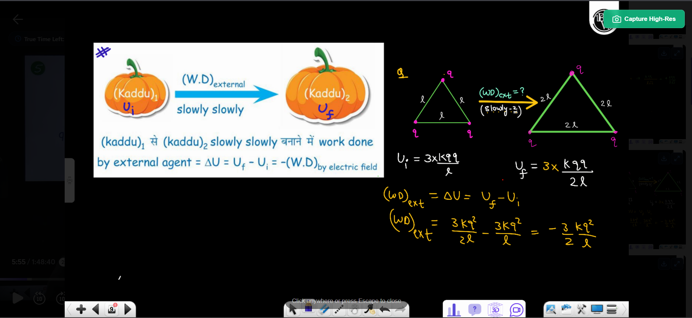

# rePW

A powerful Chrome extension designed to improve your experience on Physics Wallah (`pw.live`). It adds several highly requested features to help you study more efficiently and track your progress.

## Screenshots

| Extension Popup | TrueTime Overlay |
| :---: | :---: |
|  |  |
| **Analytics Dashboard** | **Timeline Preview** |
|  |  |

## Features

- ⏱ **TrueTime UI**: Automatically calculates and displays the exact time remaining on videos based on your current playback speed. Know exactly when your lecture will finish!
- 📊 **Advanced Analytics Dashboard**: Tracks your daily study time on the platform. Includes a GitHub-style heatmap, active streaks, efficiency breakdowns, and a prominent "Today's Study Time" dashboard. 
- 🔥 **Strict Streak System**: Only rewards consistency! A minimum of 30 minutes of study time is required to count as an active study day and maintain your streak.
- 📸 **DRM-Bypass Screenshots**: Capture lecture slides instantly via the overlay or timeline. Downloads high-res snapshots without triggering DRM black screens.
- 🌙 **Smart Dark Mode**: Enables a comprehensive dark mode across the entire site to reduce eye strain during late-night study sessions.
- ⏩ **Custom Playback Speed**: Overrides the native video player's speed limits, allowing you to watch lectures at up to 4.00x speed.

## Installation

Since this extension is not currently available on the Chrome Web Store, you can install it manually in developer mode:

1. Download or clone this repository to your local machine.
2. Open Google Chrome and navigate to `chrome://extensions/` in your address bar.
3. Enable **Developer mode** using the toggle switch in the top right corner.
4. Click the **Load unpacked** button in the top left corner.
5. Select the directory containing the extension files.
6. The extension is now installed! You can pin it to your toolbar for easy access to settings and your study time analysis.

### How to Update (Without Losing Data)

Since this is an unpacked developer extension, you must update it manually. To ensure your stored study time and analytics data are **not** wiped:

1. **Do NOT remove the extension** from `chrome://extensions/` (doing so deletes all your study history).
2. Download the updated files and **overwrite/replace** the files directly inside your existing local extension folder.
3. Open `chrome://extensions/` in Chrome.
4. Find the **rePW** card and click the circular **Reload** icon in the bottom-right corner of the card.
5. The extension will update to the latest code immediately while keeping all your stored data.

## Usage

Click the extension icon in your Chrome toolbar to open the settings panel. From there you can:
- See your total study time for the day at a glance.
- Click **Detailed Analysis** to view your study time charts.
- Toggle the **TrueTime UI** and **Dark Mode** on or off.
- Select your preferred **Custom Speed** from the dropdown menu.

## Permissions

- `storage`: Required to save your extension settings and track your study time history.
- `activeTab`, `<all_urls>`, & `scripting`: Required to bypass DRM for screenshots, inject Dark Mode, TrueTime UI, and custom speed controllers into the page.
- `downloads`: Used for saving high-res lecture slide screenshots locally.

## Credits

This project was inspired by the original PW extension project by https://github.com/0xLittleDream/PWEnhancer.

This version includes major UI redesigns, analytics improvements, bug fixes, study tracking, and additional features.